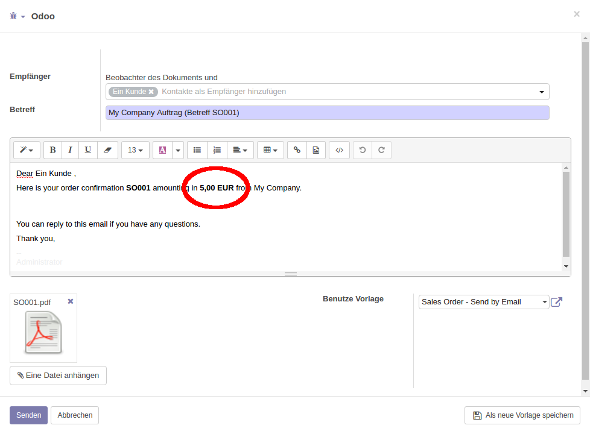

.. image:: https://img.shields.io/badge/licence-AGPL--3-blue.svg
   :target: http://www.gnu.org/licenses/agpl-3.0-standalone.html
   :alt: License: AGPL-3

=================================
Email Template: Filter "Currency"
=================================

This module adds an extra Jinja filter for email templates:

*currency(currency_obj=None, lang=None, use_symbol=False)*
    Formats a currency value.
    The optional parameter *currency_obj* allows specifying the currency browse
    record, which will be used to also display the currency symbol (default:
    none).
    The optional parameter *lang* allows specifying the language to be used for
    formatting the numerical value, e.g. for displaying the decimal separator
    (e.g., point or comma) (example: 'de_DE'; default: 'lang' of the context).
    The optional Boolean parameter *use_symbol* indicates that the currency
    symbol (or: sign, e.g. "€") should be displayed instead of the short name
    (or: code, e.g. "EUR") (default: *False*).

Usage
=====

In an email template, when displaying a currency amount by using a
straight-forward expression like

    ${object.amount_total} ${object.pricelist_id.currency_id.name}

(cf. the *email.template* "Sales Order - Send by Email")
yields a display where the value is formatted by Python like any floating point
number:

For currency amounts, this is usually not desired.
Using the new Jinja-Filter *currency* from this module instead, e.g.

    ${object.amount_total|currency(currency_obj=object.currency_id,lang=object.partner_id.lang)}

yields a more appropriate display:

Bug Tracker
===========

Bugs are tracked on `GitHub Issues <https://github.com/OCA/server-tools/issues>`_.
In case of trouble, please check there if your issue has already been reported.
If you spotted it first, help us smashing it by providing a detailed and welcomed feedback
`here <https://github.com/OCA/server-tools/issues/new?body=module:%20email_template_currency%0Aversion:%2010.0%0A%0A**Steps%20to%20reproduce**%0A-%20...%0A%0A**Current%20behavior**%0A%0A**Expected%20behavior**>`_.

Credits
=======

Contributors
------------

* Andreas Zöllner (initOS) <andreas.zoellner@initos.com>

Maintainer
----------

.. image:: https://odoo-community.org/logo.png
   :alt: Odoo Community Association
   :target: https://odoo-community.org

This module is maintained by the OCA.

OCA, or the Odoo Community Association, is a nonprofit organization whose
mission is to support the collaborative development of Odoo features and
promote its widespread use.

To contribute to this module, please visit https://odoo-community.org.

Acknowledgments
---------------

This module has been inspired by the module *email_template_dateutil*.
